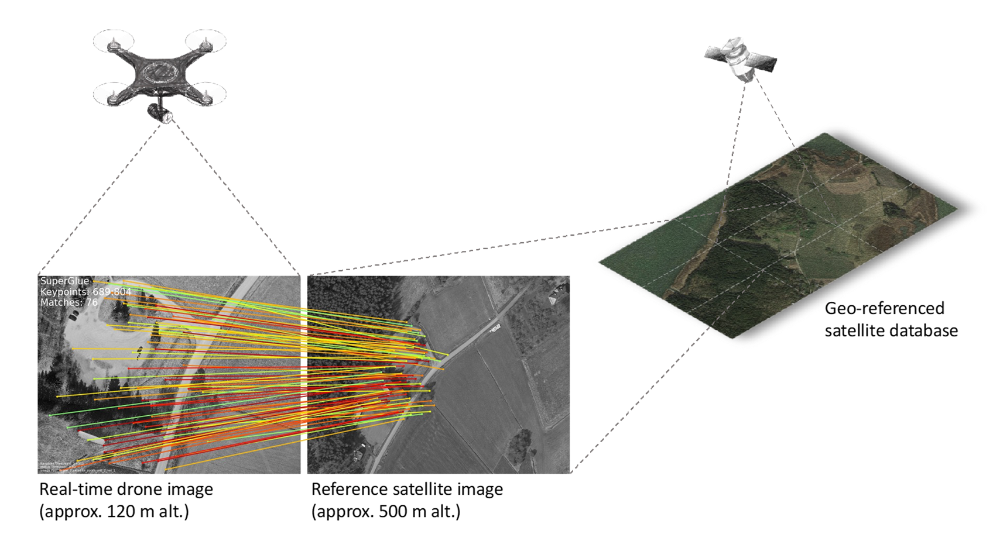
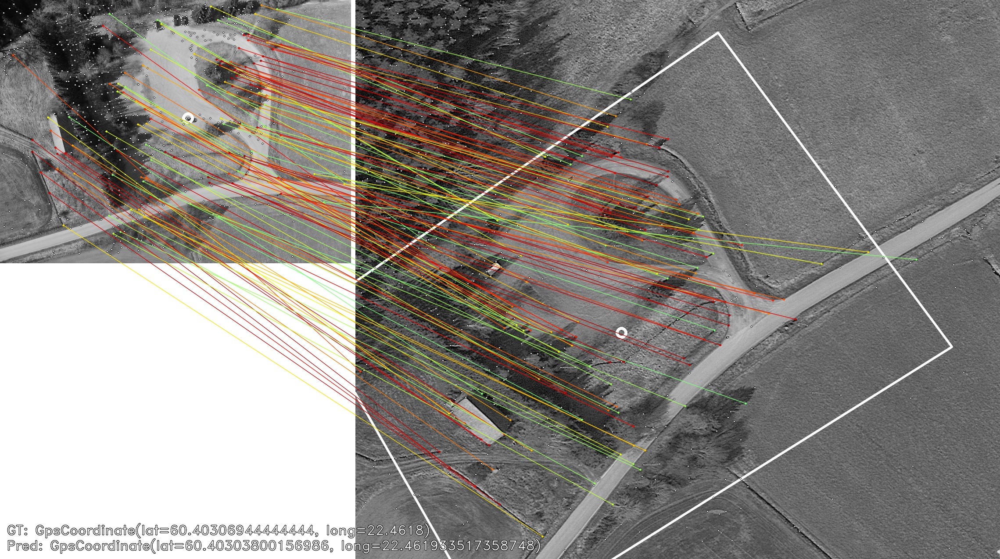
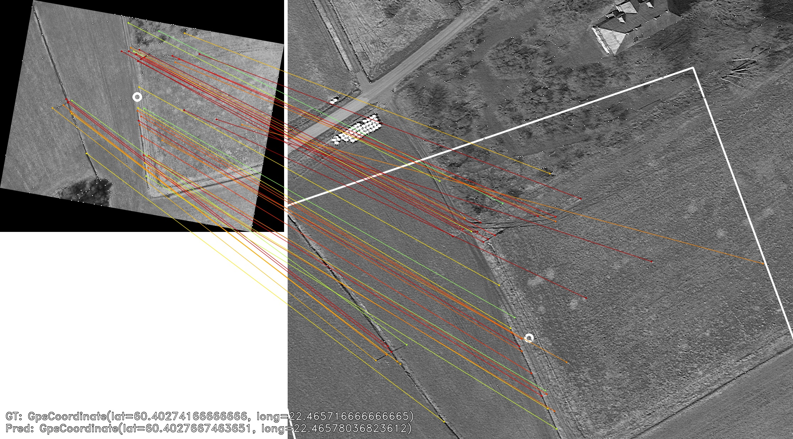

# Visual Localization for UAVs using Satellite Imagery

This repo implements the algorithms described in the paper [Vision-based GNSS-Free Localization for UAVs in the Wild](https://arxiv.org/abs/2210.09727). The original implementation of the paper can be found [here](https://github.com/TIERS/wildnav).

This repo extends the original implementation by adding new features and improvements. The main features of the repo are:
* **TMS Downloader**: Download satellite imagery from TMS servers.
* **Visual Localization**: Given a query image, the system will localize the UAV in the satellite geo-referenced database.
* **Key Point Detection, Description and Matching**: a wrapper around SuperPoint and SuperGlue for key point detection, description and matching.
* **Drone Image Dataset**: a dataset of drone images with metadata that can be used to assess the accuracy of the localization algorithm.
* **Satellite Geo-Referenced Database**: a geo-referenced database that contains the satellite images.
* **Query Processor**: a class that processes the query images (e.g., align the query images with the satellite images).


## Table of Contents

- [Overview](#overview)
- [Installation](#installation)
- [Satellite Geo-Referenced Database](#satellite-geo-referenced-database)
- [Drone Image Dataset](#drone-image-dataset)
- [Visual Localization](#visual-localization)
- [TMS Downloader](#tms-downloader)
- [Acknowledgments](#acknowledgments)
- [References](#references)
- [License](#license)

## Overview

The following figure shows the architecture of the visual localization system. The system is composed of three main components: Key Point Detection and Description, Key Point Matching and Localization. The Key Point Detection and Description component detects and describes key points in both the query image and the satellite images. The Key Point Matching component matches the key points between the query image and the satellite images. The Localization component estimates the pose of the UAV in the satellite geo-referenced database.



Here are some examples of localization algorithm:



In this example, the query image has a sparse set of key points that are matched with the satellite image.
 


## Installation

First clone the repo:

```bash
git clone git@github.com:TerboucheHacene/visual_localization.git
cd visual_localization
```

Then you need to use gitmodules to clone the *superglue_lib* submodule:

```bash
git submodule update --init --recursive
```

To install the dependencies, you need to use *poetry*. If you don't have it installed, you can install it using the following command:

```bash
pip install poetry
```

Then you can install the dependencies using the following command:

```bash
poetry install
```
This will install all the dependencies needed for the project (including the dev, docs and tests dependencies). If you want to install only the dependencies needed for the project, you can use the following command:

```bash
poetry install --only main
```

To activate the virtual environment, you can use the following command:

```bash
poetry shell
```

To run the main script, you can use the following command:

```bash
python scripts/main.py
```

## Satellite Geo-Referenced Database

Because the flight zone is generally large, it is not practical to store the satellite images in a single file. Instead, the map is split into different sections, each one is defined by the two goegraphical coordinates, a (latitude, longitude) pair for the top left corner and one for the right bottom corner. Each section is stored as a separate file. All the metadata of the sections are stored in a CSV file. The CSV file contains the following columns, which are stored in the **SatelliteMapReader.COLUMN_NAMES** list (in the **svl.satellite_map_reader** module):

```
"Filename",
"Top_left_lat",
"Top_left_lon",
"Bottom_right_lat",
"Bottom_right_long",
```

The geo-referenced database which have been used in the paper is stored in the **data/maps** directory. The flight zone is defined by the following coordinates:

```
top_left_lat = 60.408615
top_left_long = 22.460445
bottom_right_lat = 60.400855
bottom_right_long = 22.471289
```

Here is visualizations of the whole map:


If you want to create your own geo-referenced database, you can use the **svl.tms.FlightZoneDownloader** class to download the satellite images from a TMS server and save them.
For more information, you can check the **TMS Downloader** section.

## Drone Image Dataset

Two samples from the dataset used in the paper are stored in the **data/query** directory. The directory
contains also a metadata file that contains the following columns:

```
Filename
Latitude
Longitude
Altitude
Gimball_Roll
Gimball_Yaw
Gimball_Pitch
Flight_Roll
Flight_Yaw
Flight_Pitch
```

The goegraphical coordinates of the query images can be used to assess the accuracy of the localization algorithm.
The rotation angles of the gimball and the flight can be used to align the query images with the satellite images.

The full dataset can be found [here](https://utufi.sharepoint.com/sites/msteams_0ed7e9/Shared%20Documents/Forms/AllItems.aspx?id=%2Fsites%2Fmsteams%5F0ed7e9%2FShared%20Documents%2FDatasets%2FWIldnav%5FUAV%5FPhotographs&p=true&ga=1). The dataset contains two folders **matrice_300_session_1** and **matrice_300_session_2** containing 124 and 78 images respectively. Each subfolder contains the images and the metadata file.

## Visual Localization

Before you run your code, you need to have:

1. A satellite geo-referenced database that contains the satellite images, stored in the **data/maps** directory. Feel free to use the provided database or create your own database.
2. A query image dataset that contains the query images, stored in the **data/query** directory. Feel free to use the provided dataset or create your own dataset.
3. Make sure that the metadata file of the satellite images and the query images are stored in the **data/maps** and **data/query** directories respectively.

To localize the UAV in the satellite geo-referenced database, you can use the **svl.localization.Pipeline** class to run the full pipeline.

```python
from svl.localization.pipeline import Pipeline

# create the map reader
map_reader = SatelliteMapReader(...)

# create the drone streamer
streamer = DroneStreamer(...)

# create the detector
superpoint_algorithm = SuperPointAlgorithm(...)

# create the matcher
superglue_matcher = SuperGlueMatcher(...)

# create the query processor
query_processor = QueryProcessor(...)

# create the config
config = Config(...)

# create the logger
logger = Logger(...)

# create the pipeline
pipeline = Pipeline(
    map_reader=map_reader,
    drone_streamer=streamer,
    detector=superpoint_algorithm,
    matcher=superglue_matcher,
    query_processor=query_processor,
    config=config,
    logger=logger,
)

# run the pipeline
preds = pipeline.run(output_path="path/to/output/directory")
metrics = pipeline.compute_metrics(preds)
```

For a complete example, you can check the **scripts/main.py** script. The script runs the full pipeline on the provided geo-referenced database and query images and saves the results in the **data/output** directory.


## TMS Downloader

The TMS Downloader is a tool that allows you to download satellite imagery from TMS servers. The API allows you to download satellite imagery from TMS servers and save it to disk. The API supports the following features:

* Download satellite imagery from any TMS server that uses the[ Web Mercator projection](https://en.wikipedia.org/wiki/Web_Mercator_projection)
* Save the satellite tile as PNG files
* Download a rectangular map region by specifying the GPS coordinates of the top-left and bottom-right corners of the map region and saving the map region as a set of PNG files.
* Or save the map region as a single PNG/tiff/GeoTIFF file.

To download a single tile, you should specify the x, y, and the zoom level:

```python
from svl.tms import TileDownloader
from svl.tms.data_structures import Tile

tms_url = "https://c.tile.openstreetmap.org/{z}/{x}/{y}.png"
tile_downloader = TileDownloader(
    url=tms_url,
    channels=3,
    api_key=None,
    headers=None,
    img_format="png",
)

tile = Tile(x=36856, y=18881, zoom_level=16)
output_path = "path/to/output/directory"
tile_downloader.download_tile(tile, output_path)

# or you can get the image as a numpy array
image = tile_downloader.download_tile_as_image(tile)

```

To download a map region, you should define a **FlightZone** object by specifying the GPS coordinates of the top-left and bottom-right corners of the map region:

```python
from svl.tms import FlightZoneDownloader, FlightZone, TileDownloader

# define the flight zone
flight_zone = FlightZone(
    top_left_lat=60.408615,
    top_left_long=22.460445,
    bottom_right_lat=60.400855,
    bottom_right_long=22.471289,
)

# define the tile downloader
tms_url = "https://mt.google.com/vt/lyrs=s&x={x}&y={y}&z={z}"
tile_downloader = TileDownloader(
    url=tms_url,
    channels=3,
    api_key=None,
    headers=None,
    img_format="png",
)

# define the flight zone downloader
flight_zone_downloader = FlightZoneDownloader(
    tile_downloader=tile_downloader,
    flight_zone=flight_zone,
)

# download the tiles and save them as a mosaic
output_path = "path/to/output/directory"
flight_zone_downloader.download_tiles_and_save_as_mosaic(
    zoom_level=16,
    output_path=output_path,
    mosaic_format="tiff",
)
```

The structure of the output directory will be as follows:

```
output_path
├── mosaic.tiff
└── tiles
    ├── 36856_18881_16.png
    ├── 36856_18882_16.png
    ├── 36856_18883_16.png
    ├── 36856_18884_16.png
    ├── 36857_18881_16.png
    ├── 36857_18882_16.png
    ├── 36857_18883_16.png
    ├── 36857_18884_16.png
    ├── 36858_18881_16.png
    ├── 36858_18882_16.png
    ├── 36858_18883_16.png
    └── 36858_18884_16.png
```


# TODO

* Convert SuperPoint and SuperGlue to ONNX format to avoid the need to install PyTorch
* Add more Deep Learning feature detectors and descriptors
* Add more Deep Learning matching algorithms
* Improve the alignment of the query images with the satellite images
* Add Notebook examples
* Any other suggestions are welcome


# Acknowledgments

The original implementation of the paper can be found [here](https://github.com/TIERS/wildnav). I would like to thank the authors of the paper for making their code available.

I would also like to thank the authors of the SuperPoint/SuperGlue for making their code available. The code as well as the weights can be found [here](https://github.com/magicleap/SuperGluePretrainedNetwork).

Finally, I hope this project will be useful for other researchers and developers who are working on visual localization for UAVs using satellite imagery.

# References

* [Vision-based GNSS-Free Localization for UAVs in the Wild](https://arxiv.org/abs/2210.09727)
* [SuperPoint: Self-Supervised Interest Point Detection and Description](https://arxiv.org/abs/1712.07629)
* [SuperGlue: Learning Feature Matching with Graph Neural Networks](https://arxiv.org/abs/1911.11763)


# License

This project is licensed under the MIT License - see the [LICENSE](LICENSE) file for details.
